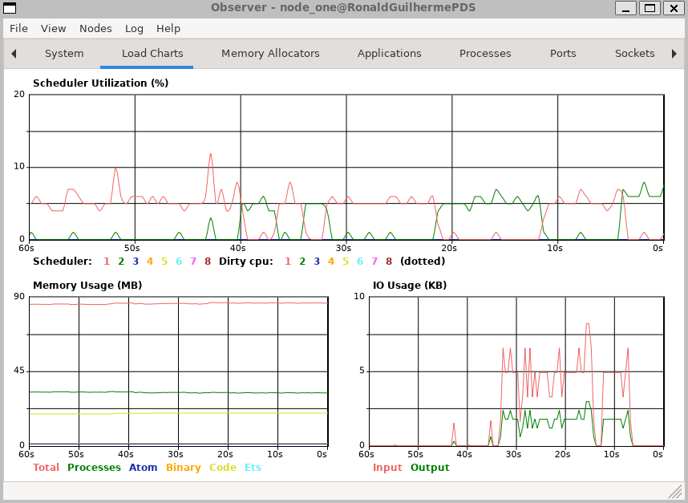

<p align="center">
  <a href="https://github.com/RonaldGuilhermePDS/OTP-Distribution">
    
  </a>
</p>

<h2 align="center">Welcome!</h2>

<p align="center">
A practical validation regarding distributed computing using elixir otp distribution.
</p>

## Getting Started

Follow the instructions to start the project without any problems.

## Installation

1. Clone the Repository
```sh
git clone https://github.com/RonaldGuilhermePDS/OTP-Distribution.git
```
2. Run with docker compose
```sh
docker-compose up
```

## Cluster Observer
<p align="center">
  <a href="https://github.com/RonaldGuilhermePDS/OTP-Distribution">
    
  </a>
</p>
